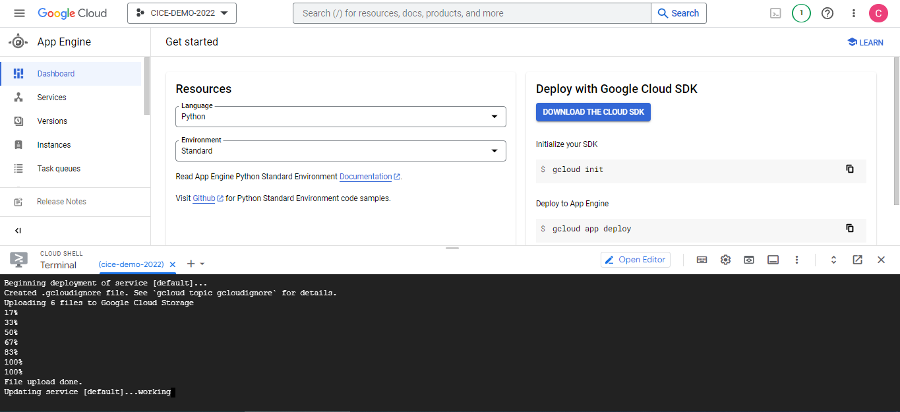
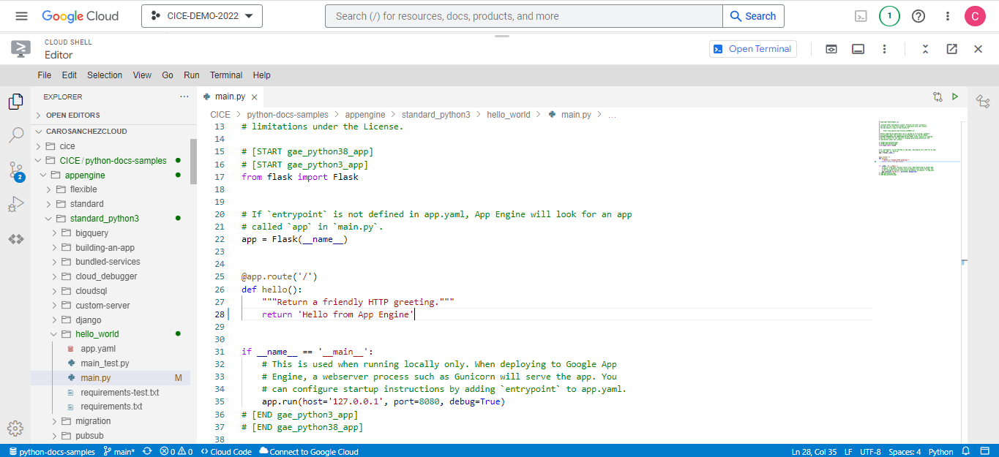
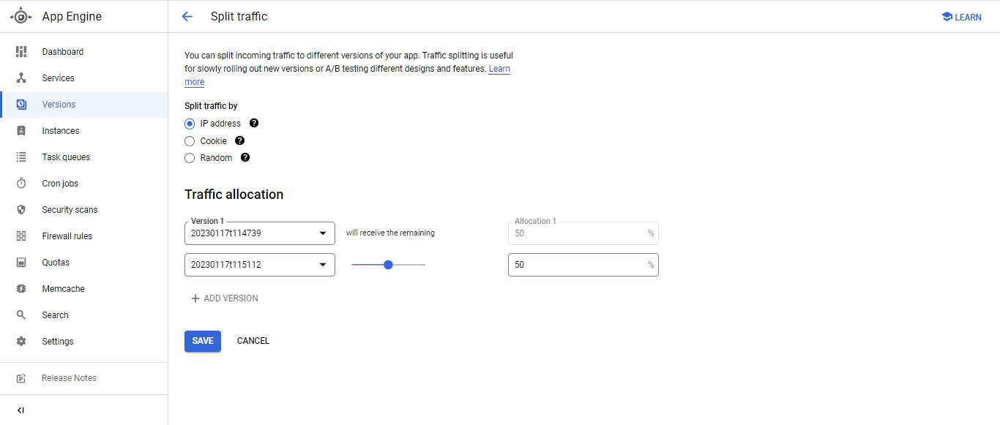

# Deploy a Python Script with App Engine

### Step 1: Deploy a Python script in CloudShell

### Step 2: Modify the code with the terminal editor

### Step 3: Split the traffic between the two versions

